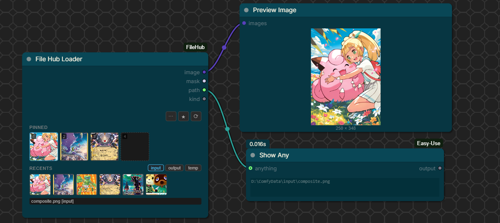

# ComfyUI-FileHub

A unified file loader and saver for ComfyUI that fixes three long-standing pain points:

1. **Cross-source navigation in one node.** Browse `input/`, `output/`, and `temp/` directories through the same node. No more separate "load from input" / "load from output" / "load from temp" nodes.
2. **Persistent uploads.** Drag a file onto the loader and it's uploaded to `input/` (where it survives), not `temp/` (where the stock LoadImage upload widget puts it and you lose it on the next swap).
3. **Save to `input/`, not just `output/`.** Promote any image to the input directory in one click — no download / re-upload round-trip needed when working on a remote ComfyUI instance.



## Nodes

### `File Hub Loader`

A single loader node with:

- **Pin slots** (4 by default) for files you want to flip between quickly. Each pin is sourceable from `input/`, `output/`, or `temp/`. Click to activate; the active pin is what gets loaded.
- **Recents row** (6 by default) showing the most recent files in the active source directory. Auto-refreshes after every generate via `execution_success`.
- **Source tabs** (`input` · `output` · `temp`) on the recents header, controlling which directory the recents row shows and which the browse modal opens to by default.
- **Browse modal** with thumbnail grid, mtime / name sort, search filter, subfolder navigation, and pagination (handles dirs with thousands of files without choking).
- **Drag-drop file from your desktop** onto a pin slot — uploads to `input/` and pins it.
- **Right-click a pin** for a context menu: replace from filesystem, browse, promote to input/, soft-delete, unpin.

Outputs:

- `IMAGE` — the loaded image (empty 64×64 placeholder if no selection)
- `MASK` — alpha channel as mask
- `path` (STRING) — absolute path of the loaded file (useful for downstream video / audio nodes)
- `kind` (STRING) — `image` / `video` / `audio` / `other`

### `File Hub Saver`

A drop-in for SaveImage with extra destinations:

- `destination` — `output` (default), `input`, or `both`
- `target loader id` + `slot` — optionally pushes the saved file straight into a `File Hub Loader`'s pin slot via the existing ComfyUI websocket. Lets you wire a "save → next-run pinned input" feedback loop without manual download / upload.

## Pin sets (global, named)

Click the ★ button in the loader to open the pin-set modal. Save the current pin layout under a name; load it back into any other loader. Stored as JSON at `<user_dir>/default/filehub_pinsets.json`.

## REST endpoints

The node ships a small set of HTTP routes under `/filehub/`:

| Route | Method | Purpose |
|---|---|---|
| `/filehub/list` | GET | List files in `input` / `output` / `temp`, paginated. Params: `type`, `subfolder`, `kinds=image,video,audio`, `sort=mtime|name`, `limit`, `offset`. |
| `/filehub/promote` | POST | Copy a file from `output/` or `temp/` into `input/`. JSON body: `{from_type, from_subfolder, from_filename, to_subfolder?, new_name?, overwrite?}`. |
| `/filehub/move` | POST | Rename / relocate a file within one source dir. |
| `/filehub/delete` | POST | Soft-delete (moves into `<source>/.filehub_trash/`). Accidentally deleted? It's still there. |
| `/filehub/poster` | GET | Video first-frame webp poster (uses `ffmpeg` if available, cached on disk). |
| `/filehub/pinsets`, `/filehub/pinsets/{name}` | GET / PUT / DELETE | Named pin-set CRUD. |

All routes use the same path-traversal guards as ComfyUI core's `/upload/image`.

## Install

Clone into your ComfyUI `custom_nodes/`:

```
cd ComfyUI/custom_nodes
git clone https://github.com/redswoop/ComfyUI-FileHub.git
```

No extra Python dependencies. `ffmpeg` on `PATH` is optional — without it, video files fall back to an icon thumbnail.

Restart ComfyUI. Search the node menu for "File Hub Loader" or "File Hub Saver".

## Notes

- Tested on ComfyUI 0.19.x with frontend 1.42.x.
- Pin state lives in the loader node's hidden `selection` widget and serializes with the workflow JSON, so save/load works.
- The package raises PIL's `MAX_TEXT_MEMORY` to 512 MB at import to prevent ComfyUI-saved PNGs (which embed full prompt+workflow JSON in tEXt chunks) from blowing up `/view` thumbnails.

## License

MIT
